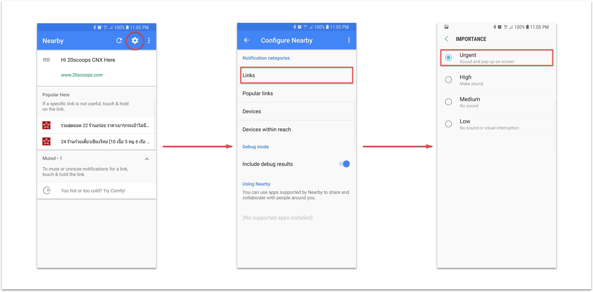

# Setup Eddystone for Android

- Step 1 - Get a beacon

    Eddystone beacons from these manufacturers will work well with all Google products that support beacons. [read more](https://developers.google.com/beacons/eddystone#beacon_manufacturers)

    

- Step 2 - Download Application Config Beacon

    You must register beacon for Google Service Nearby in this application
    ([Beacon Tools](https://play.google.com/store/apps/details?id=com.google.android.apps.location.beacon.beacontools))

- Step 3 - Configuration Nearby Notifition

    You can setup URL coontent notification nearby for your beacon on [Beacons Dashboard](https://developers.google.com/beacons/dashboard/)

- Step 4 - Enable Mode Nearby

    Finally you must to enable mode nearby on your mobile (Android) **Setting -> Google -> Nearby**

    result your can see list link or place nearby but it's not show notification or popup, So your must go to change pority in setting icon top-right corner on **Nearby** menu 👇

    